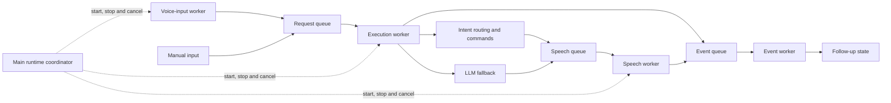

# Concurrent Runtime

CODA v1.4 separates voice input, request execution, speech playback and
runtime-event handling so the assistant can keep listening while other work is
active. This document describes the implemented runtime and its extension
points for contributors.

## Architecture at a Glance



The implementation uses Python threads, `queue.Queue` and `threading.Event`.
There is one execution worker and one speech worker, which preserves request
and conversation ordering without requiring the provider and audio libraries
to become asynchronous.

## Runtime Ownership

`coda_runtime.py` coordinates lifecycle and shared runtime state. It starts the
workers, owns the queues, tracks the active request and provides the public
submission and cancellation functions. Work itself remains in the appropriate
subsystem.

| Component | Owns | Must not own |
| --- | --- | --- |
| Main coordinator | Lifecycle, input mode, queues and shutdown | Recognition, command work or playback |
| Voice-input worker | Microphone, recognition and wake-word handling | Command execution |
| Execution worker | One active request, intent routing, commands and LLM fallback | Microphone or audio playback |
| Speech worker | TTS provider selection and ordered playback | Request routing |
| Event worker | Result handling and follow-up state transitions | Command or provider execution |
| Heartbeat worker | Dashboard liveness updates | Request state |

Thread-safe state is kept behind small boundaries:

- `ActiveRequestState` protects active-request ownership and cancellation.
- `FollowUpState` protects the voice follow-up deadline.
- `SpeechTaskQueue` retains cancellable ownership of queued, resolving and
  playing speech until the worker completes each task.
- `SpeechPlaybackController` protects the active provider session.
- `RuntimeQueue` wraps `queue.Queue` for worker communication.

## Workers

### Voice-input worker

`VoiceInputWorker` runs `utils.voice_recognizer.run()` on the
`coda-voice-input` thread. Recognition records the transcript, applies
wake-word and follow-up rules, then creates a `RuntimeRequest`. It submits that
request without running the command itself and immediately returns to
listening.

The voice recognizer also handles wake-word stop phrases. A phrase such as
`coda stop` calls the coordinator's cancellation boundary instead of creating
a normal request.

### Execution worker

The `coda-execution` thread consumes the request queue in FIFO order. For each
request it:

1. Claims the request through `ActiveRequestState`.
2. Calls `utils.on_command.run()` with the request's cancellation event.
3. Runs intent detection and dispatches a matched command, or uses LLM
   fallback when nothing matches.
4. Converts the command outcome into an `ExecutionResult`.
5. Queues response text for speech only when the request was not cancelled.
6. Clears active ownership and publishes the result to the event queue.

Only one request executes at a time. Additional requests remain queued unless
a caller deliberately submits a replacement request.

### Speech worker

The `coda-speech` thread consumes `SpeechTask` objects in FIFO order. A
`SpeechTaskProcessor` tries the configured TTS providers, while
`SpeechPlaybackController` owns the current provider session and exposes a
provider-neutral stop operation. `SpeechTaskQueue` retains each task from
submission through completion, so cancellation can still reach speech waiting
in the queue or resolving a provider before playback starts.

The worker publishes `STARTED`, followed by `COMPLETED`, `CANCELLED` or
`FAILED`. Provider failures are isolated to the task, so the worker remains
available for later speech.

Commands use `utils.speak_response.speak_response()` rather than talking to
the speech worker directly. During normal runtime startup that function is
configured with `submit_speech_response()`, so command speech becomes a
`SpeechTask` associated with the active request. Standalone callers retain the
synchronous fallback when no submitter is configured.

### Event and heartbeat workers

The `coda-events` thread consumes both `ExecutionResult` and `WorkerEvent`
objects. It closes follow-up state when speech starts and opens the requested
follow-up window after successful speech completion. When an execution result
requests follow-up without queueing response speech, the event worker can open
the window immediately. Cancellation and failure keep it closed.

The heartbeat worker remains separate and periodically updates dashboard
liveness. It does not participate in request processing.

## Messages and Queues

The runtime uses immutable dataclasses from `runtime/messages.py`.

| Message | Important fields | Purpose |
| --- | --- | --- |
| `RuntimeRequest` | Message, source, unique ID, creation time, cancellation event, replacement flag | Input waiting for execution |
| `ExecutionResult` | Request ID, handled, response text, follow-up, cancelled, error | Final execution outcome |
| `SpeechTask` | Request ID, text, the same cancellation event, follow-up | Ordered speech work |
| `WorkerEvent` | Worker, event type, request ID, error, follow-up | Worker lifecycle result |

`RuntimeQueues` contains three independent FIFO queues:

- `requests`: voice and manual input to the execution worker.
- `speech`: response text to the speech worker.
- `events`: execution and speech outcomes to the event worker.

Workers use bounded `get(timeout=...)` waits. This avoids busy-waiting while
still allowing a shutdown event to be noticed when a queue is empty. Generic
queue messages are paired with `task_done()`, while the speech worker calls
`SpeechTaskQueue.complete()` to release cancellable ownership and mark the item
done.

## Request Lifecycle

The normal request path is:

```text
voice recognised or manual text entered
  -> wake word or follow-up accepted
  -> RuntimeRequest created
  -> request queue
  -> execution worker claims request
  -> intent command or LLM fallback
  -> optional SpeechTask
  -> speech worker and provider session
  -> worker events
  -> follow-up state updated
```

The request ID correlates execution, speech and events. The same
`threading.Event` instance is carried from `RuntimeRequest` into `SpeechTask`
and into interruptible LLM provider calls. A new request receives a new event,
so cancellation is scoped to one request.

`RuntimeRequest.replace_active=True` provides the programmatic replacement
boundary: submitting that request first signals the active request and then
queues the replacement. Ordinary voice submissions currently queue normally;
they do not set `replace_active`, and voice-triggered replacement is not
currently implemented.

## Cancellation and Interruption

Cancellation is cooperative because Python cannot safely kill a worker thread.
The runtime therefore propagates one per-request event through every boundary
that can observe it.

When cancellation is requested:

1. `ActiveRequestState.cancel_active()` sets the active request's event.
2. `SpeechTaskQueue.cancel_current()` signals the oldest outstanding speech
   task, whether it is queued, resolving providers or playing.
3. `SpeechPlaybackController.stop()` stops the active provider session only
   when it belongs to that selected task, so a later response cannot be stopped
   during a worker handoff.
4. Intent/LLM handling checks the event before and after dispatch and provider
   attempts.
5. OpenAI and Ollama use provider streaming internally, close the active
   response when the event is set and discard partial text.
6. `llm_service` removes the pending user turn instead of committing a
   cancelled response to conversation history.
7. A cancelled execution result does not queue its final `response_text` for
   speech or record that final response in the dashboard.
8. The event worker keeps follow-up state closed.

Cancellation is not a provider failure and does not trigger another provider.
After cancellation, the same workers can process the next request normally.
If cancellation happens after execution has completed, the tracked speech task
is still signalled while it is queued, resolving a provider or playing. This
prevents or stops audio, but does not retract response text already stored in
conversation history or dashboard state.

Command modules do not currently receive the runtime cancellation event in
their `IntentRequest`. The execution layer suppresses a command's late result,
but arbitrary blocking command code cannot be forcibly stopped. A command can
also call `speak_response()` during dispatch, before the execution layer's
final cancellation check; speech or dashboard text already submitted that way
is not retracted. Keep command work bounded; a command that needs cooperative
interruption requires an explicit extension to the command contract.

The optional local intent classifier also does not yet receive the request
cancellation event. Cancellation is observed immediately after classification
returns. Conversational OpenAI and Ollama generation is interruptible.

## Graceful Shutdown

Both manual `quit`/`exit` and Ctrl+C leave through `shutdown_runtime()`. A lock
and event make the operation idempotent, so a repeated shutdown request does
nothing rather than stopping resources twice.

The implemented order is:

1. Close follow-up state.
2. Stop voice input so no new requests are accepted.
3. Signal the active request's cancellation event.
4. Signal and join the execution worker.
5. Disconnect new speech submission.
6. Cancel outstanding speech, stop active playback, signal and join the speech
   worker.
7. Signal and join the event worker.
8. Signal and join the heartbeat worker.

Each join has a timeout. Once the execution worker observes its shutdown
signal, queued requests left behind the active request remain unprocessed,
while active interruptible work receives its normal cancellation signal.
Ctrl+C therefore exits without a traceback and leaves the runtime ready for a
clean process restart.

## How Commands Interact with the Runtime

A command keeps the normal drop-in contract:

```python
from ai.intents import Intent, IntentRequest
import utils.speak_response as speech


INTENT = Intent(
    name="greet",
    description="Greet the user.",
    examples=("Say hello.",),
)


def run(request: IntentRequest) -> bool:
    speech.speak_response("Hello!")
    return True
```

In either input mode, the execution worker calls this function.
`speak_response()` submits speech asynchronously and associates it with the
active runtime request. The command should return `True` when handled and
`False` when it could not complete; it should not create a runtime worker,
manipulate queues or own a TTS provider.

General LLM chat differs slightly: `utils.on_command` returns response text to
the execution worker, which records and queues it after the final cancellation
check.

Manual mode validates and strips the wake word on the main thread, then creates
an `InputSource.MANUAL` request and submits it to the shared request queue. The
execution worker therefore serialises manual and voice commands, preserves
conversation ordering and hands manual LLM replies to the speech worker through
the same response path.

See [Command Modules](command-modules.md) for the full command contract and
[Intent Routing](intent-routing.md) for strategy and dispatch behaviour.

## Main Files

| File | Responsibility |
| --- | --- |
| `coda_runtime.py` | Coordinator, worker lifecycle, request execution, events, cancellation and shutdown |
| `runtime/messages.py` | Immutable runtime message contracts |
| `runtime/runtime_queue.py` | Typed queue wrappers, tracked speech ownership and queue set |
| `runtime/active_request.py` | Thread-safe active request ownership |
| `runtime/follow_up.py` | Thread-safe voice follow-up deadline |
| `runtime/voice_worker.py` | Voice thread lifecycle |
| `runtime/speech_worker.py` | Speech processing and worker lifecycle |
| `runtime/speech_playback.py` | Provider-neutral active playback ownership |
| `utils/voice_recognizer.py` | Recognition, wake words, stop phrases and request submission |
| `utils/on_command.py` | Intent dispatch, LLM fallback and cancellation checkpoints |
| `utils/speak_response.py` | Command-facing asynchronous speech boundary |

## Tests and Current Limits

Run the runtime-focused tests with:

```powershell
python -m unittest `
  tests.test_runtime_queue `
  tests.test_runtime_execution `
  tests.test_runtime_coordination `
  tests.test_runtime_shutdown `
  tests.test_speech_worker `
  tests.test_voice_worker -v
```

The tests cover FIFO communication, request identity across workers,
cancellation and recovery, worker exceptions, interruptible speech, graceful
shutdown and pending work. They coordinate with events and queues instead of
depending on fixed sleeps.

Current limits include:

- One command or LLM request executes at a time.
- One speech task plays at a time.
- Ordinary submissions queue rather than replacing active work.
- Arbitrary command code and local intent classification are not interruptible.
- Provider tokens are accumulated internally; incremental display and speech
  are future work.
