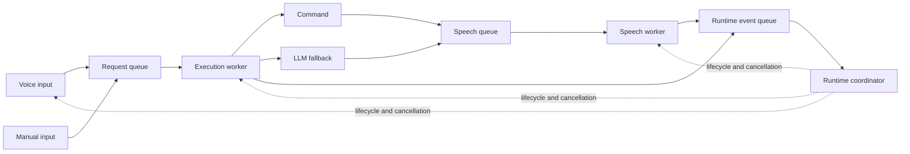

# Concurrent Runtime

This document describes the proposed runtime model for CODA v1.4.0. It is a
design for the work in this milestone, not a description of the current
implementation.

## Why the Runtime Is Changing

CODA already starts voice recognition on a separate thread. That thread still
handles the complete request, though:

```text
Microphone
  -> speech recognition
  -> intent routing
  -> command or LLM execution
  -> speech playback
  -> listen again
```

While a command, LLM provider or speech system is busy, the voice thread cannot
listen for an interruption. Manual mode has the same problem because it runs a
command directly from the main loop.

The new runtime separates input, execution and output without changing how a
normal command is written.

## Proposed Flow



The first version should use Python threads, `queue.Queue` and
`threading.Event`. CODA's microphone, provider and speech libraries already use
blocking calls, so moving the whole application to `asyncio` is not required.

## Runtime Coordinator

The coordinator owns the runtime lifecycle. It should:

- Create and start workers.
- Own the runtime queues.
- Track the active request and input mode.
- Create cancellation signals for active work.
- Ignore results from requests that have been replaced or cancelled.
- Stop and join workers during shutdown.

The coordinator should coordinate work rather than perform speech recognition,
command execution, provider calls or speech playback itself.

## Workers

### Voice-input worker

The voice-input worker owns the microphone and recognizer. It should:

- Listen for and transcribe speech.
- Detect wake words and interruption phrases.
- Submit accepted input to the request queue.
- Return to listening without executing the request itself.

Manual input should submit the same request type. It may remain a lightweight
main-thread input adapter initially; it must not call commands directly once the
execution worker is introduced.

### Execution worker

The execution worker owns request processing. It should:

- Consume requests in order.
- Run intent routing and command dispatch.
- Use the LLM fallback when no intent handles the request.
- Publish completion, failure and cancellation events.

The first version should have one execution worker. This keeps command and
conversation history ordered while still allowing listening and speech playback
to operate independently.

### Speech worker

The speech worker owns TTS playback. It should:

- Consume speech tasks in order.
- Track the active playback operation.
- Stop playback when the active request is cancelled.
- Recover after provider errors or interrupted playback.
- Remain ready for the next speech task.

The existing heartbeat can remain an independent background service. It should
eventually be started and stopped through the coordinator so shutdown has one
clear owner.

## Runtime Messages

The exact classes will be introduced with the runtime queue, but the design
expects these messages:

### `RuntimeRequest`

- Unique request ID.
- Original message text.
- Input source, such as `manual` or `voice`.
- Creation time.
- Per-request cancellation event.

### `ExecutionResult`

- Request ID.
- Whether the request was handled.
- Optional response text.
- Whether a follow-up window should open.
- Optional error information.

### `SpeechTask`

- Request ID.
- Text to speak.
- Per-request cancellation event.

### `WorkerEvent`

- Worker name.
- Event type, such as started, completed, cancelled or failed.
- Related request ID when applicable.
- Optional error information.

The initial implementation may combine `ExecutionResult` and `WorkerEvent` if
that keeps the queue API smaller. Request IDs and cancellation signals should
remain present either way.

## Queues

The proposed runtime uses three queues:

- The request queue carries input to the execution worker.
- The speech queue carries text to the speech worker.
- The event queue carries results and worker state back to the coordinator.

Workers should wait on queues rather than repeatedly checking them in a busy
loop. Shutdown must also wake workers that are waiting for queue items.

## Shared-state Ownership

Workers communicate through queues, events and coordinator methods. They should
not directly modify another worker's internal state.

- The coordinator owns lifecycle, input mode, active request and cancellation.
- The voice-input worker owns the microphone and speech recognizer.
- The execution worker owns the request it is currently processing.
- The speech worker owns the TTS engine and current playback.
- Dashboard and runtime-state modules expose observable state and must protect
  shared writes where concurrent access is possible.

State exposed by the coordinator should be read or changed through a small,
thread-safe API rather than through public global variables.

## Cancellation

The runtime needs two separate cancellation levels:

- A shutdown event tells every worker that CODA is exiting.
- A per-request cancellation event tells workers to abandon the active request.

Cancellation is cooperative. Python cannot safely kill a running thread, and
some provider calls may not support stopping an in-flight request. Workers
should check cancellation before and after blocking operations where possible.

Every request receives a unique ID. If a cancelled provider call eventually
returns, the coordinator compares its ID with the active request and ignores the
stale result. A stale result must not be spoken or added as the current response.

The provider-specific work needed to stop network generation or audio playback
belongs in the later interruption cards.

## Shutdown

A normal shutdown should happen in this order:

1. Stop accepting new requests.
2. Set the global shutdown event.
3. Cancel the active request.
4. Wake workers waiting on queues.
5. Stop active speech playback and release audio resources.
6. Join each worker with a timeout.
7. Report any worker that did not stop cleanly.

The coordinator should perform this sequence for manual exit, runtime errors and
other supported shutdown paths.

## Command Interface

Commands keep their existing drop-in structure:

```python
INTENT = Intent(...)


def run(request: IntentRequest) -> bool:
    ...
```

Commands do not need to know about threads or queues. Intent routing and command
dispatch move onto the execution worker, but the dispatcher continues calling
`run(request)` in the same way.

`speak_response()` becomes the boundary for speech. When the concurrent runtime
is active it can submit a `SpeechTask`; tests and standalone callers can retain
the current synchronous fallback. Existing commands therefore do not need to
manage a speech worker themselves.

## Initial Limitations

- Commands and LLM requests execute one at a time.
- Cancellation cannot forcibly terminate arbitrary Python code.
- A provider response may finish after cancellation, but its stale result will
  be ignored.
- Provider-specific streaming and cancellation are separate pieces of work.
- Reliable interruption while CODA is speaking may depend on microphone and
  echo-cancellation behaviour outside the runtime coordinator.
- Background command execution and task prioritisation are not part of the
  first implementation.

This design gives CODA a responsive runtime without making command development
more complicated. The next implementation step is the thread-safe runtime queue
and its message types.
